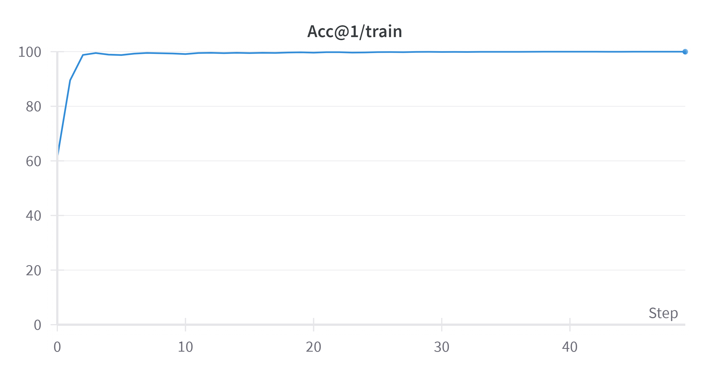
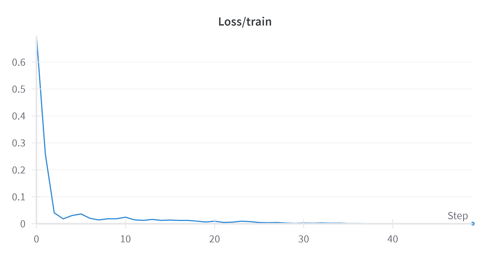

# CMT: Convolutional Neural Networks Meet Vision Transformers

A PyTorch implementation of CMT based on paper [CMT: Convolutional Neural Networks Meet Vision Transformers](https://arxiv.org/abs/2107.06263v2).

## Usage
### Training
```bash=
python main.py
```

```bash=
optional arguments:
  -h, --help            show this help message and exit
  --gpu_device GPU_DEVICE
                        Select specific GPU to run the model
  --batch-size N        Input batch size for training (default: 64)
  --epochs N            Number of epochs to train (default: 20)
  --num-class N         Number of classes to classify (default: 10)
  --lr LR               Learning rate (default: 0.01)
  --weight-decay WD     Weight decay (default: 1e-5)
  --model-path PATH     Path to save the model
```

---

## Experiments Results (Cifar-10)






|Model  |     Dataset    | Learning Rate |   LR Scheduler | Optimizer |  Weight decay |   Acc@1  |
|-------|:--------------:|:-------------:|:--------------:|:---------:|:-------------:|:--------:|
|CMT-Ti |  pain-database |  6e-5         | Cosine LR      |  AdamW    |  1e-5         |  82.55%  |


---
## Requirements
python version 10
cuda 12.1
pytorch (download from https://pytorch.org)
---

## Citation

    @misc{guo2021cmt,
      title={CMT: Convolutional Neural Networks Meet Vision Transformers},
      author={Jianyuan Guo and Kai Han and Han Wu and Chang Xu and Yehui Tang and Chunjing Xu and Yunhe Wang},
      year={2021},
      eprint={2107.06263},
      archivePrefix={arXiv},
      primaryClass={cs.CV}}

---
